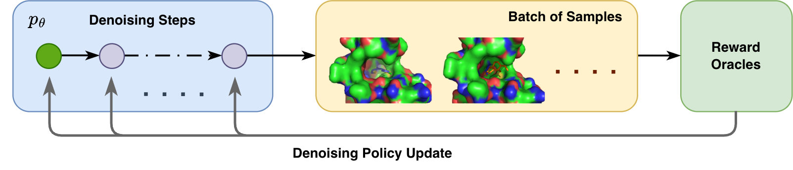

# Fine-tuning Pocket-Aware Diffusion Models via Denoising Policy Optimization
---
This repository is the official implementation of **DEPPA**, a structure-based molecule optimization method.



## Environment
```bash
conda create -n deppa python=3.10
conda install -c conda-forge rdkit=2022.9.5 numpy=1.26.4 scipy biopython=1.79 openbabel imageio seaborn wandb debugpy matplotlib spyrmsd qvina=2.1.0
conda install -c conda-forge prolif datamol 
conda install -c mx reduce
pip install torch==2.1.0 torchvision==0.16.0 torchaudio==2.1.0 --index-url https://download.pytorch.org/whl/cu118
pip install torch-scatter -f https://data.pyg.org/whl/torch-2.1.0+cu118.html
pip install torch-geometric==2.6.1 pytorch-lightning==2.5.5
pip install posecheck
pip install hydride
```

## Data Preparation 

1. Download the dataset archive crossdocked_pocket10.tar.gz and the split file split_by_name.pt from [this link](https://drive.google.com/drive/folders/1CzwxmTpjbrt83z_wBzcQncq84OVDPurM).
2. Extract the TAR archive using the command: tar -xzvf crossdocked_pocket10.tar.gz.

## Pretrained Pocket-aware Diffusion Model
The pretrained model for RL to optimize is to be downloaded from [this link](https://drive.google.com/file/d/1Ri0Nf4yfW73EntpOE62MrVQOYoSrEk2a/view?usp=drive_link) and saved to folder `checkpoints/`

## RL Training
```bash
python -u batch_generate_ligands_rl.py checkpoints/crossdocked_fullatom_cond.ckpt --dataset_dir datasets/processed_crossdock_noH_full_temp/test --sanitize --n_samples 32 --rollouts 100 --inference_interval 5 --wandb_mode online --w_qed 0.2 --w_sa 0.2 --w_vina_score 0.5 --w_distance 0.1 --w_strain 0.0
```

## Evaluation
**Evaluate final sampling results**
This evaluates QuickVina2 metrics (Vina Score, Vina Min, Vina Dock, scRMSD), PoseCheck metrics (Strain Energy, Steric Clash), diversity

```bash
python post_metrics.py --results_dir {results_dir} --csv_name raw_eval.csv
```

**Evaluate the top-N ligands**
```bash
python rerank_summarize_results.py --results_dir {results_dir} --top_n 10
python python post_metrics.py --results_dir {results_dir} --csv_name {top_n_csv}
```

**Compute high-affinity rate in two steps.**

First, compute the binding affinity of the reference ligand molecules given test set directory. 

```bash
python eval_high_affinity.py \
  --compute_ref_affinity \
  --pocket_pdb_dir {test_set_dir}
```
This writes the reference affinity CSV to `affinity_ref.csv`.

Second, compute the high-affinity rate for generated ligands using the sampling results directory, the per-pocket CSV file name, the reference affinity CSV, and the Vina metric to compare.

```bash
python eval_high_affinity.py \
  --results_dir {results_dir} \
  --csv_name {csv_name} \
  --ref_affinity_csv affinity_ref.csv \
  --vina_mode vina_dock
```

Use `--vina_mode vina_score` or `--vina_mode vina_dock` depending on which metric should define high affinity.
